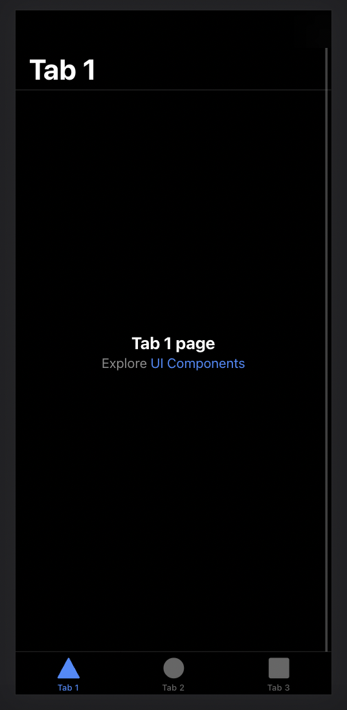

# Ionic 101

## Installation

Installation of Ionic CLI. *Node version recommended: 14.17.6*

```
npm install -g @ionic/cli
```

If *WARNINGS* come out, **ignore** this.
```terminal
changed 212 packages, and audited 213 packages in 7m

26 packages are looking for funding
  run `npm fund` for details

4 high severity vulnerabilities

To address all issues (including breaking changes), run:
  npm audit fix --force

Run `npm audit` for details.
```
Ionic was installed correctly.

## Create an Ionic App

Run in terminal

```
ionic start
```

We select following options

```
? Use the app creation wizard? (Y/n) n

? Framework: (Use arrow keys)
❯ Angular | https://angular.io
  React   | https://reactjs.org
  Vue     | https://vuejs.org

? Project name: my-chess-club

? Starter template:
> tabs         | A starting project with a simple tabbed interface
  sidemenu     | A starting project with a side menu with navigation in the content area
  blank        | A blank starter project
  list         | A starting project with a list
  my-first-app | An example application that builds a camera with gallery
  conference   | A kitchen-sink application that shows off all Ionic has to offer
```

We can run it with

```
ionic serve
```



## Project Structure

Same as the usual Angular project, the core code is located in the `src` directory.

```
src
├── app
│   ├── app-routing.module.ts
│   ├── app.component.html
│   ├── app.component.scss
│   ├── app.component.spec.ts
│   ├── app.component.ts
│   ├── app.module.ts
│   ├── explore-container
│   │   ├── explore-container.component.html
│   │   ├── explore-container.component.scss
│   │   ├── explore-container.component.spec.ts
│   │   ├── explore-container.component.ts
│   │   └── explore-container.module.ts
│   ├── tab1
│   │   ├── tab1-routing.module.ts
│   │   ├── tab1.module.ts
│   │   ├── tab1.page.html
│   │   ├── tab1.page.scss
│   │   ├── tab1.page.spec.ts
│   │   └── tab1.page.ts
│   ├── tab2
│   │   ├── tab2-routing.module.ts
│   │   ├── tab2.module.ts
│   │   ├── tab2.page.html
│   │   ├── tab2.page.scss
│   │   ├── tab2.page.spec.ts
│   │   └── tab2.page.ts
│   ├── tab3
│   │   ├── tab3-routing.module.ts
│   │   ├── tab3.module.ts
│   │   ├── tab3.page.html
│   │   ├── tab3.page.scss
│   │   ├── tab3.page.spec.ts
│   │   └── tab3.page.ts
│   └── tabs
│       ├── tabs-routing.module.ts
│       ├── tabs.module.ts
│       ├── tabs.page.html
│       ├── tabs.page.scss
│       ├── tabs.page.spec.ts
│       └── tabs.page.ts
├── index.html
├── main.ts
```

Let's explain some of the main components

### index.html

Genesis of the application. It has the `<app-root>` tag which includes the whole application. It's defined in the `app.component.*` files.

### app.component.*

The `app.component.html` includes the `<ion-router-outlet>`, which is the tag that will be replaced by the corresponding *page* depending on the value of the URL according to what is defined in the `app-routing.module.ts`.

*`Page`: A page in Ionic is similar to a component. The only difference is that it includes its own `routing.module`. This is done in order to take advantage of [lazy loading](https://angular.io/guide/lazy-loading-ngmodules), which avoids loading HTML, CSS, JS files unless the specific URL is opened*

Let's take a look at `app-routing.module.ts`:

```ts
const routes: Routes = [
  {
    path: '',
    loadChildren: () => import('./tabs/tabs.module').then(m => m.TabsPageModule)
  }
];
```

### tabs.component.*

The page contains the tabs at the bottom of the page. Addtionally, it contains its own `tabs-routing.module.ts` which includes more paths (subpaths actually). One for each tab:

```ts
const routes: Routes = [
  {
    path: 'tabs',
    component: TabsPage,
    children: [
      {
        path: 'tab1',
        loadChildren: () => import('../tab1/tab1.module').then(m => m.Tab1PageModule)
      },
      {
        path: 'tab2',
        loadChildren: () => import('../tab2/tab2.module').then(m => m.Tab2PageModule)
      },
      {
        path: 'tab3',
        loadChildren: () => import('../tab3/tab3.module').then(m => m.Tab3PageModule)
      },
      {
        path: '',
        redirectTo: '/tabs/tab1',
        pathMatch: 'full'
      }
    ]
  },
  {
    path: '',
    redirectTo: '/tabs/tab1',
    pathMatch: 'full'
  }
];
```

The tabs that are shown in the bottom are specified in the `tabs.page.html`

```html
<ion-tabs>

  <ion-tab-bar slot="bottom">
    <ion-tab-button tab="tab1">
      <ion-icon name="triangle"></ion-icon>
      <ion-label>Tab 1</ion-label>
    </ion-tab-button>

    <ion-tab-button tab="tab2">
      <ion-icon name="ellipse"></ion-icon>
      <ion-label>Tab 2</ion-label>
    </ion-tab-button>

    <ion-tab-button tab="tab3">
      <ion-icon name="square"></ion-icon>
      <ion-label>Tab 3</ion-label>
    </ion-tab-button>
  </ion-tab-bar>

</ion-tabs>
```

### tabX.component.*

Each `tabX.component.html` has the content of each page. Each of them have their own `routing.module`. This way, you can include more pages inside of each of them if desired.

In this example, they are all using the `explore-container` component.

## Reorganizing our tabs

### Adding a new tab

Let's create a tab in which we will display the members.

```
ionic generate page members
```

Let's delete the tabs that were created and recreate them with a more proper name for us.

As you can see, it is added by default to the `app-routing.module`. Let's move it to `tabs-routing` in order to keep it more organized.

We also remove the other tabs since we are not going to use them yet.

```ts
// tabs-routing.module.ts

const routes: Routes = [
  {
    path: '',
    component: TabsPage,
    children: [
      {
        path: 'members',
        loadChildren: () => import('../members/members.module').then( m => m.MembersPageModule)
      },
      {
        path: '',
        redirectTo: '/members',
        pathMatch: 'full'
      }
    ]
  },
  {
    path: '',
    redirectTo: '/members',
    pathMatch: 'full'
  }
];
```

We also add it to the `tabs.page.html` and remove the other tabs

```html
<!-- tabs.page.html -->
<ion-tabs>

  <ion-tab-bar slot="bottom">
    <ion-tab-button tab="members">
      <ion-icon name="triangle"></ion-icon>
      <ion-label>Members</ion-label>
    </ion-tab-button>
  </ion-tab-bar>

</ion-tabs>
```

Our `members.page.html` looks like this:

```html 
<!-- members.page.html -->
<ion-header>
  <ion-toolbar>
    <ion-title>Members</ion-title>
  </ion-toolbar>
</ion-header>

<ion-content>
  <ion-header collapse="condense">
    <ion-toolbar>
      <ion-title size="large">Members</ion-title>
    </ion-toolbar>
  </ion-header>
</ion-content>
```

### Deleting other tabs

Let's delete the code of the other tabs since we are not going to need them yet.

```
rm -rf src/app/tab[1-3]
```


