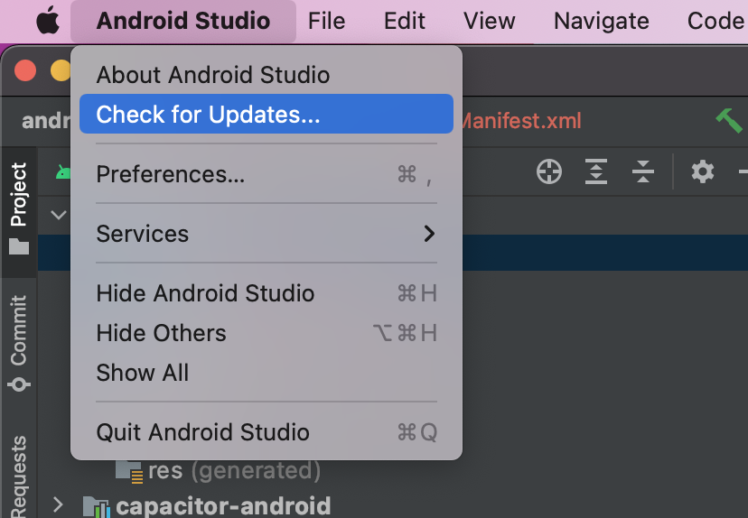
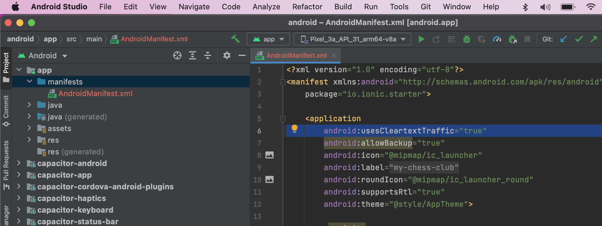

# Deployment in Simulator or Device

First we need the following dependencies:

```
npm install -g @ionic/cli native-run cordova-res
```

For deploying our app in a mobile device, we need to first build the project

```
ionic build
```

## iOS

If you are using Xcode for the first time, you may need to install the Xcode Development Tools:

```
xcode-install
```

We generate the iOS project

```
ionic cap add ios
```

And we can open the project in Xcode with the following command:

```
ionic cap open ios
```

You can read the following [link](https://github.com/franciscovilchezv/coding-in-apple-silicon/blob/main/ionic/README.md) for common issues when installing dependencies or generation iOS project.

### Deploying in a device

- If you want to deploy the app in you mobile device, you will need to create a team and select a valid bundle name


- Additionally, in your mobile device, you must trust the application deployed under `Settings > Configuration > Profile and Device`.

## Android

You may have to install [the following dependency](https://stackoverflow.com/a/65372165/4962221) before anything.

Additionally, you may need to update your Android Studio SDKs.



We generate the Android project

```
ionic cap add android
```

We can now open the project in [Android Studio](https://developer.android.com/studio?gclid=Cj0KCQiAkNiMBhCxARIsAIDDKNUx9TLc3zzCN5zmWBQYX_QeXS4pUdxKdQkfteL5TTH4H03Pkho9Wx4aAuPoEALw_wcB&gclsrc=aw.ds#downloads) with the following command:

```
ionic cap open android
```

You may need to add `        android:usesCleartextTraffic="true"
` in your `app/manifests/AndroidManifest.xml` in order to allow HTTP requests for you app:



### Deploying in a device

Help wanted.

## Testing with our backend

Since we are running our backend locally (e.g. `locahost:3000`), the mobile device won't recognize our backend as `localhost`. If our phone shares the same network as our backend, then we can change the calls to the IP of the computer instead. You can use the following command to view your local ip:

```
ifconfig
```
